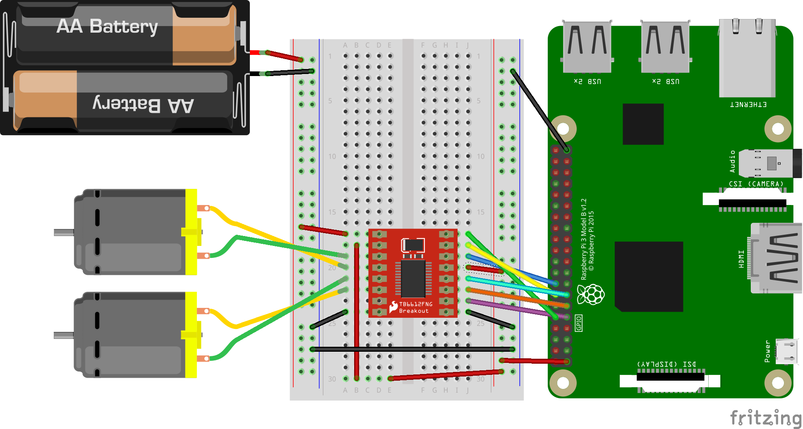

# Johnny Ruxpin

experiment to control Teddy Ruxpin motors with [Johnny-Five](http://johnny-five.io/)


## Note
Since I eventually want to evolve this to play and lip sync to wav files, I've decided to utilize a Raspberry Pi. Theoretically, you should easily be able to port this to any other board J5 supports.

## What You'll Need
- Teddy Ruxpin
- RaspberryPi 3 (probably works on earlier versions, but unverified)
- Breadboard
- jumpers
- Sparkfun TB6612FNG H-Bridge Breakout
- 5v 1A power supply & micro USB connector (to power Pi)
- 5v 1A power supply & power connectors (for motor power)

## Wiring


## Assumptions
- Pi is setup and accessible over network
- basic node installation is completed (tested on 0.10)

## Installation
```sh
cd [project directory]
npm install
```

## Configuration
note the pinouts assigned in `puppet.js`, they explicitly match the wiring described in the included fritzing diagram. If you use different pins, you'll need to update the variables accordingly.

## Running the puppet app
```sh
sudo node puppet.js
``` 

this will open the Johnny-Five [REPL](http://johnny-five.io/examples/repl/)

open eyes: `eyes.open()`
close eyes: `eyes.close()`
blink eyes: `eyes.blink()`

open mouth: `mouth.open()`
close mouth: `eyes.mouth()`
flap mouth: `mouth.flap()`

open eyes & mouth: `all.open()`
close eyes & mouth: `all.close()`
blink eyes & flap mouth: `all.blink()`

to exit the REPL: `.exit`